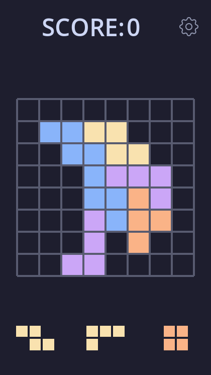

# librast

Play your favourite brain-fu\*\*ing puzzle game!

This is all you need to waste huge amount of time and not be productive at all.

Beat you highscores or something idk but this time without annoying adds and other data mining, privacy invading features.

## How to play:

Your goal is to place the blocks on the grid so everything fits and clear rows and columns by making straight lines from the blocks. I guess you know the drill.

## Features:

- Main screen with buttons and high score indicator
- Settings in which you can change completely nothing (actual setting comming soon™)
- Game with different shaped blocks
- Auto snapping grid (or at least i tried to make it that way)
- Game logic that detects if you can't place any more blocks
- Score
- Pause menu

## Assets Used:

I guess i only used settings icon from [tabler](https://tabler.io/icons). The rest is just godot colored sprites.

## Tech Stack:

This project is built with [Godot](https://godotengine.org/) Engine with `GDScript`. Also a bit of figma to mage png for settings icon.

## Project Setup:

This is just a godot game so everyting you need to do is:

1. Clone this repo: git clone `https://github.com/Piernikkk/librast.git`
2. Open godot
3. Click Import -> Browse -> Select cloned repo -> Import
